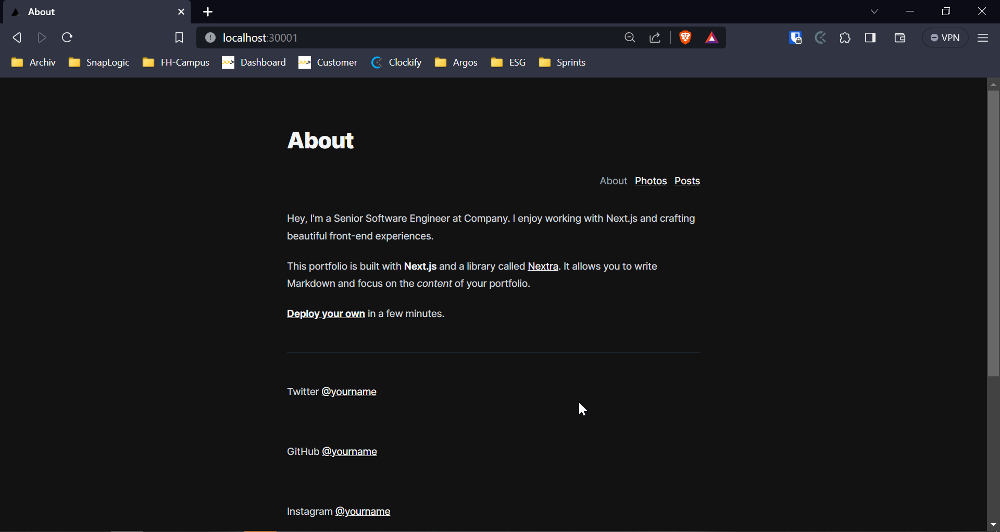
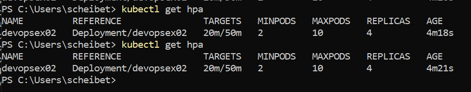
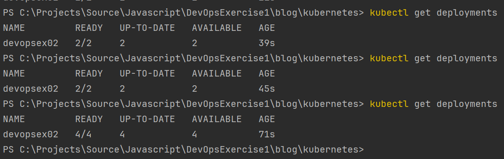

# Exercise

## Apply

1. `cd kubernetes`
2. `kubectl apply -f .`
3. Verify accessibility via the specified port (in my case fixed NodePort 30001)
4. 

## Scale manually

* Run `kubectl scale --replicas=4 deployment/devopsex02` to raise the replica count to 4

## Automatic scaling

1. Create namespace, deployment, service, scaler
2. Run busybox to send continuous requests to the service: `kubectl run -i --tty load-generator --rm --image=busybox:1.28 --restart=Never -- /bin/sh -c "while sleep 0.01; do wget -q -O- http://devopsex02-svc:3000; done"`
3. Watch the HPA to automatically scale up your replicas
4. 
5. 
